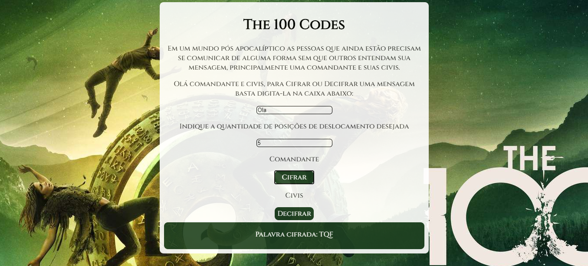

# The 100 Codes

* [1. Jogo](#1-Jogo)
* [2. Objetivo](#2-Objetivo)
* [3. Usuários](#3-Usuários)
* [4. Interface](#4-Interface)
* [5. Autoria](#5-Autoria)

## Jogo

Esse jogo permite ao usúario entrar em sua série e agir como seus comandantes ou civis.

## Enredo

Esse site é baseado na série The 100. Noventa e sete anos após uma guerra mundial nuclear 100 prisioneiros são enviados à Terra. O que eles não sabiam era que existiam sobreviventes. Com esses jovens desconhecidos na terra os comandantes precisam enviar mensagens para seus exércitos sem que as mensagens sejam interceptadas no meio do caminho.

# Objetivo

Poder dicifrar ou cifrar mensagens, a partir do deslocamento inserido pelo usário.

# Usuários 

* Comandantes
* Civis

# Interface

# Autoria

 Nicole França Gonçalves

 A partir de um projeto da @Laboratoria

 Créditos reservados à série The 100 by CW Television Network

# Licença

Projeto distribuído sob a licença CC BY-NC.